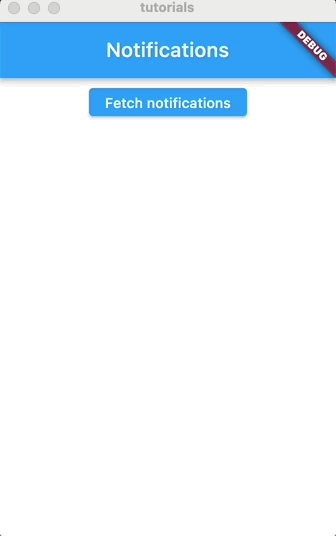
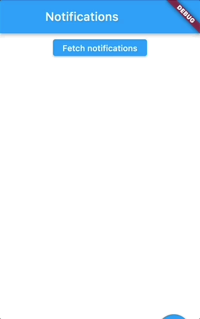

Managing state in a client app is always a tricky (and opinionated) topic.
Web developers are familiar with tools like Redux or MobX. These tools follow very specific patterns that are not always easy to learn or understand by new developers. 

These same tools exist in the Flutter world, but recently I've been exploring an alternative that may seem consistently easier. We can manage app state with rxdart and get_it.

# Some background
At any given moment, an application will have *state*. If we think of an app like Instagram, the state can be
the list of posts and stories the application renders. State can also be your app preferences, the contents of the 
story you're about to post, the list of notifications and the number of un-read messages.

In general, state is data.

Let's think of notifications. When a user sends you a message, many components in the application need to reflect this change of state: The little red dot that tells you have un-red messages must be rendered, the list of messages must be updated, and so on.

At a lower level, state is a collection of variables. In Flutter, we extend the `StatefulWidget` class when we want to create a widget that will contain state:

```dart
import 'package:flutter/material.dart';

class Update {
  Update({required this.description});

  String description;
}

class MyStatefulWidget extends StatefulWidget {
  @override
  State<StatefulWidget> createState() => MyStatefulWidgetState();
}

class MyStatefulWidgetState extends State<MyStatefulWidget> {
  List<Update> updates = [];

  @override
  Widget build(BuildContext context) {
    print("Updates: $updates");
    return Column(
      children: [
        ElevatedButton(
          onPressed: () {
            fetchUpdates().then((newUpdates) {
              setState(() {
                updates = newUpdates;
              });
            });
          },
          child: const Text("Fetch notifications"),
        ),
        Flexible(
          child: ListView.builder(
            itemCount: updates.length,
            itemBuilder: (BuildContext context, int index) {
              return ListTile(
                title: Text(updates[index].description),
              );
            },
          ),
        )
      ],
    );
  }
}

```

The `MyStatefulWidgetState` widget renders the following view:



In this example, when the user clicks the `Fetch notifications` button, the function `fetchUpdates()` is called. This function returns a Future object, and once the request completes successfully, we set the list of updates in the variable `updates`.

The variable `updates` is state within this widget.


Calling `setState` when we set the new value of the variable `updates` will re-render this widget *only*. If this widget contains other widgets (e.g. the `ElevatedButton` and the `ListView`), those widgets will be re-rendered as well.

Now, we want to add an icon to the top bar to indicate the user that new notifications have been fetched. The following widget will render that notification icon:

```dart
import 'package:flutter/material.dart';

class NotificationIcon extends StatelessWidget {
  @override
  Widget build(BuildContext context) {
    var notificationsCount = 0;
    return Stack(
        children: <Widget>[
        const Icon(Icons.notifications),
        Positioned(
            right: 0,
            child: Container(
            padding: EdgeInsets.all(1),
            decoration: BoxDecoration(
                color: Colors.red,
                borderRadius: BorderRadius.circular(6),
            ),
            constraints: const BoxConstraints(
                minWidth: 12,
                minHeight: 12,
            ),
            child: Text(
                '$notificationsCount',
                style: const TextStyle(
                color: Colors.white,
                fontSize: 8,
                ),
                textAlign: TextAlign.center,
            ),
            ),
        )
        ],
    );
  }
}
```

How can we notify the `NotificationIcon` widget that `MyStatefulWidget` has fetched a new list of notiications?

## Some options...

We could re-render our component to include `NotificationIcon` in `MyStatefulWidget`. The problem with this approach is that we may need to also include other, unrelated widgets.

Another approach is to use [Inherited Widgets](https://api.flutter.dev/flutter/widgets/InheritedWidget-class.html). However, this approch may require us to modify other widgets than these two, which is not always possible.

How can we notify to independent widgets of state changes? 

Enter state management.

# State management through streams

Data streams are analog to queues: One part of the application will publish data to a stream and other parts of the application can subscribe that stream and consume the data it produces.

We can rely on streams to communicate state changes across independent components.

A popular implementation of streams for Flutter apps is [rxdart](https://pub.dev/packages/rxdart).

We can add them to our project with the following command:

```
flutter pub add rxdart
```

## Creating a stream

Then, we can create a service to create a stream:

```dart
import 'package:rxdart/rxdart.dart';

import 'MyStatefulWidget.dart';

class NotificationsService {
  final BehaviorSubject<List<Update>> notificationSubject = BehaviorSubject.seeded([]);

  ValueStream get stream$ => notificationSubject.stream;
  
  updateNotifications(List<Update> updates) {
    notificationSubject.add(updates);
  }
}
```

Before we can use this service, we need a way for widgets to access a shared instance of the stream. For this, we will use [get_it](https://pub.dev/packages/get_it):

```
flutter pub add get_it
```

## Registering a service

This tools is a **service locator**: It allows us to create singleton instances of objects and share it across the application without having to pass them as paramaters.


We can create an instance of `NotificationService` when the app starts as follows:

```dart
void main() {
  GetIt getIt = GetIt.I;
  getIt.registerSingleton<NotificationsService>(NotificationsService());
  runApp(const MyApp());
}
```

Now, anywhere in our app, we can get this singleton instance with the following code:

```dart
GetIt getIt = GetIt.I;
var service = getIt.get<NotificationsService>();
```

We update `MyStatefulWidgetState` to get the service, and send the new updates to the stream:


```dart
fetchUpdates().then((newUpdates) {
    GetIt getIt = GetIt.I;
    var service = getIt.get<NotificationsService>();
    service.updateNotifications(newUpdates);
    ...
```

## Subscribing to the stream

Now, we will update `NotificationIcon` to subscribe to the stream and listen for new updates.

For this, we will use `StreamBuilder`, which accepts a stream and re-renders its contents when the stream produces new results.

The following code shows the updated version of `NotificationIcon`:


```dart
import 'package:flutter/material.dart';
import 'package:get_it/get_it.dart';

import 'MyStatefulWidget.dart';
import 'NotificationsService.dart';

class NotificationIcon extends StatelessWidget {
  late NotificationsService service;

  NotificationIcon() {
    GetIt getIt = GetIt.I;
    service = getIt.get<NotificationsService>();
  }

  @override
  Widget build(BuildContext context) {
    return StreamBuilder(
      stream: service.stream$,
      builder: (BuildContext context, AsyncSnapshot<dynamic> snapshot) {
        if (!snapshot.hasData || snapshot.data == null) {
          return const CircularProgressIndicator();
        }

        List<Update> updates = snapshot.data;

        if (updates.isEmpty) {
          return Container();
        }
        var notificationsCount = updates.length;

        return Stack(
          children: <Widget>[
            const Icon(Icons.notifications),
            Positioned(
              right: 0,
              child: Container(
                padding: EdgeInsets.all(1),
                decoration: BoxDecoration(
                  color: Colors.red,
                  borderRadius: BorderRadius.circular(6),
                ),
                constraints: const BoxConstraints(
                  minWidth: 12,
                  minHeight: 12,
                ),
                child: Text(
                  '$notificationsCount',
                  style: const TextStyle(
                    color: Colors.white,
                    fontSize: 8,
                  ),
                  textAlign: TextAlign.center,
                ),
              ),
            )
          ],
        );
      },
    );
  }
}

```


Focus on the important part here:

```dart
 return StreamBuilder(
      stream: service.stream$,
      builder: (BuildContext context, AsyncSnapshot<dynamic> snapshot) {
        if (!snapshot.hasData || snapshot.data == null) {
          return const CircularProgressIndicator();
        }

        List<Update> updates = snapshot.data;

        if (updates.isEmpty) {
          return Container();
        }
        var notificationsCount = updates.length;
        // ... render the notification icon
```

Since the stream may be empty, we need to handle the case where the widget has not received any updates. The class `AsyncSnapshot` has multiple methods that allow us to check the stream state and act accordingly.

Now, when the user clicks in the button, the new updates will be sent to the stream and all widgets listening to it will re-render:




We could take this example even further and make `MyStatefulWidgetState` a stateless widget, getting its state directly from the same stream. Feel free to take this extra step and practice this state management approach.

# Pros and cons

Some of the advantages of this state management approach are:

- It is simple. Multiple, independent widgets can be notified of state changes without changing their parent widgets, and without passing any extra props.
- It allows us to use more stateless widgets. Stateless widgets have a more predictable behavior, and require less boilerplate code.
- It reduces unnecessary re-rendering. If we were to pass app state as properties through the widget tree, all intermediate widgets will be re-rendered when state changes. With this approach, only the widgets that need to re-render do so.
- Less conventions. There is no defined API to follow. No reducers or mappers. While conventions are useful for large projects, smaller apps can benefit of the flexibility this approach provides.


On the other side, the disadvantages are:
- It may be *too* flexible. This approach opens the door to a lack of structure in the project. More structure is better for large teams and large code bases.
- If not used responsibly, `get_it` can lead to a bunch of global state. Developers can abuse the magic of this service locator and add state that doesn't need to be stored.

# Conclusion

State management is hard. Because of these, developers have created many tools to store state and communicate state changes. Some of those tools will fit better to your specific project needs.

Using streams along with a service locator is a simple yet effective way to handle global state.
